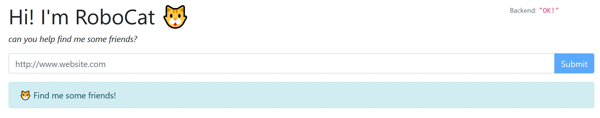

## Instructions



Write an axios based webscraper that will collect an arbitrary website's title, and any heading that contains the words (case insensitive) "cat", "kitten", "dog", or "puppy".

For example, if you enter `https://www.reddit.com/r/aww` into the form, hit submit, the web page should show:

```json
{
    "title": "A subreddit for cute and cuddly pictures",
    "headers": [
        "Sleepy kitten doing a face hug",
        "I finally got a puppy. I couldn’t possibly wish for anything more. She’s beautiful.",
        "Kitten Drifting",
        "Cat devours dog",
    ]
}
```

If you enter `https://www.cnn.com`, the webpage should just show

```json
{
    "title": "CNN - Breaking News, Latest News and Videos",
    "headers": []
}
```


### Implementation Details

The UI is functionally complete. You will need to complete the backend `POST /findfriends` REST API. See the `src/server/server.js` file to get started.

When submitted, the form sends a request with `axios` to the backend express REST API. 

That backend REST API should then request the specified webpage and scrape the title and headers, and return a plain JavaScript object in the above format. The request should again be run via `axios` (or a similar http client).

You will likely need to add some libraries to assist with parsing content.


### Grading

You will be graded primarily on:

- 1. Functionality
    - How well does the scraper perform? Does it scrape all the content? Can it bypass scraping protections on certain hard to scrape websites?
- 2. Code quality
    - Did you write clean, idiomatic, easy to read JavaScript?
- 3. Timeliness
    - were you able to complete the requirements within the allotted time frame?
- 4. Failure recovery and reporting
    - Does your scraper handle and recover from failure scenarios? Does it expose upstream website errors so they're easy to understand (if, e.g. the site doesn't allow requests from bot?)

#### Extra Credit

If you have finished the project, and have time to go the extra mile, and enhance this project to show off your particular skillset, that will be taken into account. For example, if you're an exceptionally skilled UI developer, and would like to make the UI result reporting nicer, that will be taken into account. Or if you have extra time, you could add behavior to follow some links to find even more friends for robocat


### Getting Started
Clone this repo

```bash
git clone https://github.com/chatmeter/robocat
```

Make sure you have node 10+ installed. Navigate to the `robocat` folder, and run `npm i`.

To run the project (server and client). Run `npm run dev`.

Update and add files until to complete the project. Server root is located at `src/server/server.js` and the client root is located at `src/client/client.js`

When complete, send a forked repository or zip file of the completed source. 

